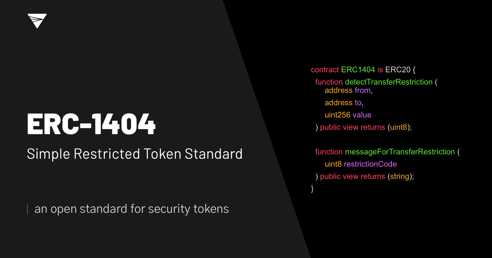

 

   

*Designed with input from issuers, securities law firms, and exchanges.*

The EIP is open for comment [here](https://github.com/ethereum/EIPs/issues/1404).

## Video Walkthroughs

##### SF Cryptocurrency Devs Presentation on ERC-1404, Harbor R-Token, and Polymath ST-20

##### ERC-1404 and How Open-Source Standards will Accelerate Security Token Adoption

## Blog

### ERC-1404 Articles on Medium

Read more about ERC-1404, its features and benefits at our [Medium blog](https://medium.com/erc1404).

[ERC-1404 One Year Later](https://medium.com/tokensoft/erc-1404-one-year-later-1bf2d8c93432)

[ERC-1404 found in SEC filings](https://www.prnewswire.com/news-releases/ethereums-erc-1404-included-in-sec-filings-300943573.html)

## Features

### Know Your Token Holders

Know who your token holders are at all times and maintain a whitelist of investor addresses. From re-running sanctions checks to requiring accredited investors only, the simple restricted token standard helps token issuers manage their compliance requirements.

### Enforce Complex Restrictions

Enforce complex transfer restrictions. Such as: 

* A preventative poison pill provision, to restrict the maximum ownership of a single individual or entity. 
* The ability to prevent token holders in a single jurisdiction to trade with token holders in another jurisdiction.
* The ability for the issuer to revoke a token if necessary.

### Support for Branded Standards

Integrate one standard for global adoption while meeting your compliance requirements. Supports branded standards like Polymath's ST-20 or Harbor's R-Token. See [examples](https://github.com/simple-restricted-token/simple-restricted-token/tree/master/contracts/examples/other-standards) here.

## Built With The Ecosystem In Mind

### Issuers

If you're seeking to issue a security token, ERC-1404 provides all the tools you need to follow your counsel's guidance with respect to compliance requirements.

### Exchanges

This standard was designed with significant input from the major exchanges to be interoperable across exchanges and easy to integrate on any stack. If this standard does not meet your needs, please open up a Github issue [here](https://github.com/simple-restricted-token/simple-restricted-token/issues).
  
### Legal Counsel or Compliance Teams

It may be challenging to navigate transfer restrictions in the open source world of blockchain. ERC-1404 provides the tools necessary for your issuers to comply with the applicable domestic and international regulatory requirements.
